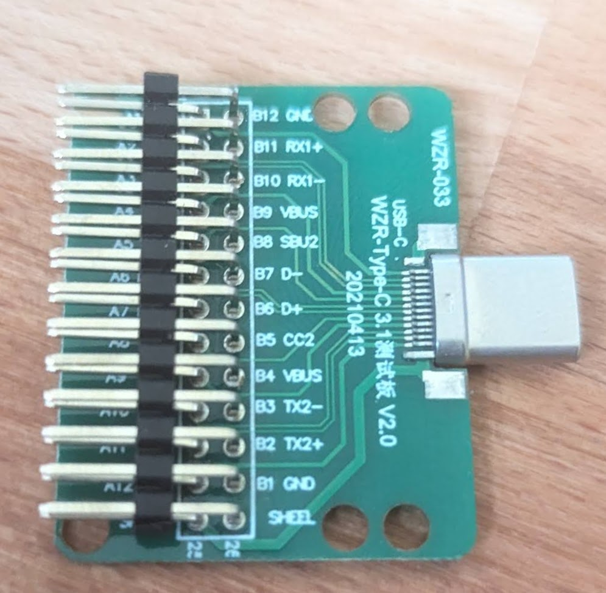
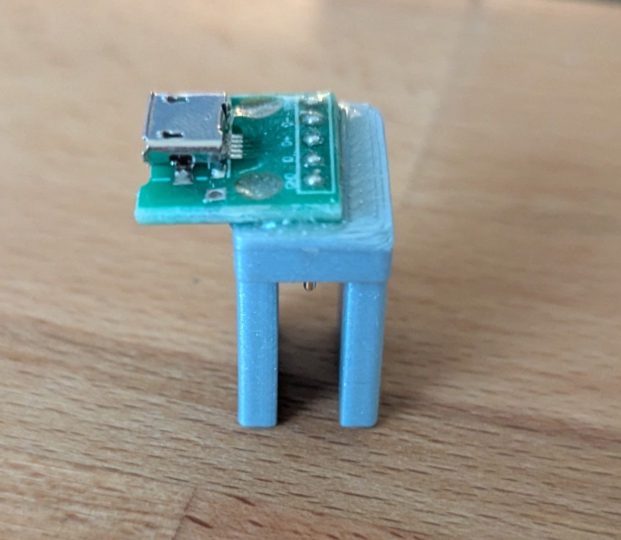

# Remarkable2-recovery
This Repository is inspired by and heavly dependand on https://github.com/ddvk/remarkable2-recovery the have done a great job of Documenting the Process.

This Repository is just a Personal "Wiki" in whitch i document my expirients with recovering a Remarkabel 2 out of a Soft-Brick.
I will also be sharing my method of creating full disk backups in case of future misshaps.

**It is best to read the instructions fully befor starting tue to being under time pressure while in the midst of it. And PLEASE do not just copy the commands shown!**

## Prerequisits
Like disgussed in ddvk´s guide you need a

- USB-C Breakout Board (It needs to have a full breakout, not just  VBUS, D+ ,D-, GND) 

- Micro USB to Pogo Pin adapter,
> Pogo pins are as follows, when viewed from the side, device facing up (VBUS is near the usb-c) ```GND,ID,D+,D-,VBUS```


- [imx_usb_loader](https://github.com/boundarydevices/imx_usb_loader) I´ve included the version DDVK originaly gave out. It is in the imx_usb dirrectory, but can also be self-compiled.

## Guide

### Getting into Recovery mode
I recomend using tmux or multiple terminals due to needing to monitor multiple commands.

1. Run ```dmesg -w``` to get a continual output of the Kernel Logs
2. Power of the Rm2 (hold power button for 10 sec)
3. Plug in the USB-C breakout board with B8 pulled down to B12 / GND via a 10K resistor
4. Connect Pogo Pins (Watch out that you have a solid connection and no shorts (**MAKE SURE YOU USE THE PROPER ORIENTATION, YOU RISK FRYING YOUR DEVICE IF CONNECTED INCORECTLY** be warnd.))
5. Plug in micro USB cable into computer with a known good cable.
6. If the remarkable did not start on its own power it on with the Press of the Power Button.
7. Look at the dmesg output, there should be a line saying ```USB HID v1.10 Device [Freescale SemiConductor Inc SE Blank ULT1]```
8. **REMOVE Pulldown**, the next steps wont work with the pulldown still there
9. Run the imx_usb binary from the imx_usb directory (can be done with ```sudo ./imx_usb``` command)
10. You should see a dmesg with says ```USB Mass Storage device detected```

You can now mount the Mass Storage device if it were a normal USB Stick


### Recovering the RM2
To recover the RM2 back to normal opperation you can use a backup you have previusly made (see [Backup](#Backup) section) or a use the 2. Root Partition.

__I recomend even making a backup of the bricked rm2, just so you have a backup else if you make a mistake here, there is basicly very litle way of returning.__

The partion layout of the RM2 is as follows:

```
1. boot stuff
2. root
3. another root
4. the /root/ homedir, plus some extra stuff.
```

If you want to access your files look in the /root/ partition.

Mount and look at the two root dirs (so partition 2 and 3) and figure out whitch was active during your bricking and whitch is the copy. You can do soo by looking at the modification dates of the files and the entries in the journal.

After you have figured out whitch partition was active and whitch not. You can copy flash new firmware to recover the rm2

WARNIGN: as mentioned before do a backup befor this, if you loose your "good" partition i have no idea how to recover from that.

To get the new Firmware you can use [codexctl](https://github.com/Jayy001/codexctl)

Check for versions:
```bash
./codexctl.bin list
```
Select your desired version from the list, and download sayed version with:
```bash
./codexctl.bin dowload -hd rm2 3.11.2.5
```
There should now be a file named ```{VERSION-Number}_reMarkable2-{CRYPTIC-STRING}.signed``` (It might be in your Downloads Dir). Get the file in the Same dir as you are curently in.

Then run codexctl to extract the raw block image from the signed format:
```bash
./codexctl.bin extract --out rm2_recover.img {VERSION-Number}_reMarkable2-{CRYPTIC-STRING}.signed
```
Now you should have a ```.img``` file. You can now mount the firmware file.

----
DANGER: DO NOT PROCED IF YOU ARE UNSURE. Please Check and Re-Check everything.

Mount the rm2 system partiton:
```bash
sudo mount /dev/sde2 /mnt
```

Remove old System
```bash
sudo rm /mnt/* -r
```
and copy over the update files, make sure to preserver all properties on the copy command
```bash
sudo cp -a /Where/ever/your/img/is/* /mnt
```
repeat these steps with partition 3.
Once Done Unmount the RM 2 and Boot. If it is still not booting, it’s reasonable to suspect there was a write error over the unideal pogo connection (keep monitoring the dmesg logs). Reset and try again.


# Other very usefull guides
https://operand.ca/2021/09/27/how_i_bricked_then_recovered_my_remarkable_2.html

https://sabitech.net/post/remarkable2-pogo-flash/
